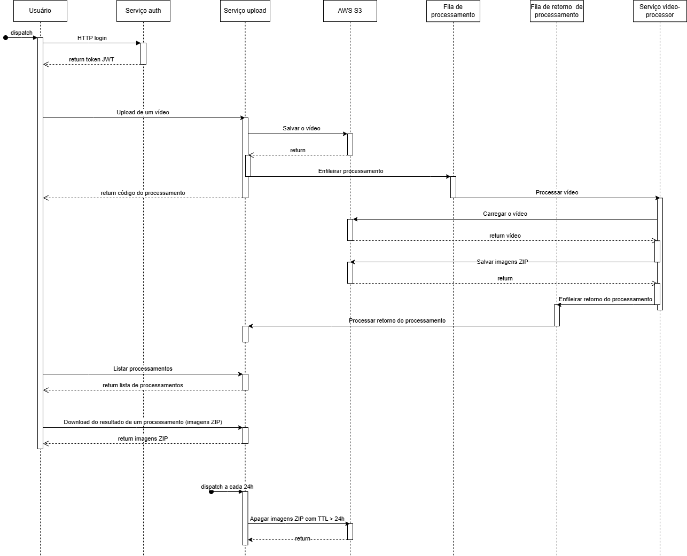

# Good Video
Documentação geral do projeto goodvideo.   
Trabalho final da Pós Tech FIAP (2025).  
[Descrição do desafio.](doc/Hack%20SOAT%206_7.pdf)

## Repositórios
- [Serviço Usuário](https://github.com/goodvideo-postech-org/goodvideo-auth)
- [Serviço Upload](https://github.com/goodvideo-postech-org/goodvideo-upload)
- [Serviço Processamento](https://github.com/goodvideo-postech-org/goodvideo-video-processor)

## Sonar
[Sonar](https://sonarcloud.io/organizations/goodvideo-postech-org/projects?sort=name)

## Event storming / DDD
[Link do board no Miro](https://miro.com/app/board/uXjVLxYrinA=/?share_link_id=903786219199)

## Diagramas
Para editar, abrir os diagramas no [App Diagrams.net](https://app.diagrams.net/)

### Diagrama de Arquitetura

### Diagrama de Sequência

## Tecnologias
- Java 17;
- Postgres;
- AWS S3 / AWS RDS;
- Kafka;
- JWT;
- Kubernetes;

# Equipe
Carlos Bridi - RM355971  
Nicollas P. Eissmann - RM355576  
Daniel R. Martini - RM355054  
Roberto Debarba - RM355038
